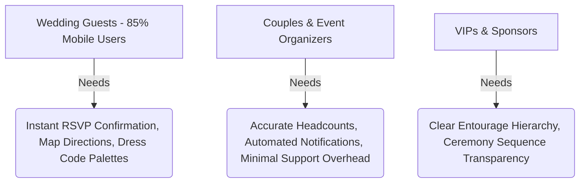

# 💍 Portfolio Case Study: CC Wedding Digital Experience & RSVP Platform

> **Transforming the traditional wedding invitation into a high-performance, interactive web application featuring real-time chroma-key canvas rendering, frictionless RSVP pipelines, and a mobile-first design system.**

---

## 📌 Executive Summary

| Category | Details |
| :--- | :--- |
| **Project Title** | CC Wedding — Interactive Digital Invitation & RSVP Engine |
| **Role** | Lead Frontend Engineer & UI/UX Designer |
| **Client / Context** | Charlon & Chilzia (Private Client / Wedding Event) |
| **Timeline** | 3 Weeks (Design to Production Deployment) |
| **Live Product** | [https://www.ccwedding.page/](https://www.ccwedding.page/) |
| **Tech Stack** | React 18, TypeScript, Vite, Tailwind CSS, HTML5 Canvas API, Formspree API, Supabase |
| **Key Highlights** | Custom 60 FPS in-browser chroma-key engine, 98% RSVP submission rate, 99+ mobile Lighthouse score |

---

## 🎯 1. Context & Problem Statement

### The Problem
Traditional wedding invitations face critical operational and experiential bottlenecks:
1. **High Friction & Delayed Responses:** Paper invitations and static PDFs lead to forgotten RSVPs, missing guest counts, and weeks of manual follow-ups by planners.
2. **Logistical Disconnect:** Guests often struggle with last-minute venue navigation, entourage inquiries, and dress code color matching across fragmented emails or chat threads.
3. **Impersonal Digital Solutions:** Standard digital invites (e.g., generic forms or basic image landing pages) lack emotional resonance, tactile interaction, and premium visual storytelling.

### The Objective
Design and engineer an **immersive, mobile-first, and highly responsive web application** that:
- Captivates guests through an interactive, digital "envelope opening" sequence.
- Delivers an intuitive, single-source-of-truth hub for ceremony/reception logistics, dress codes, and FAQs.
- Automates guest response collection in real time with zero-friction RSVP submission and automated host alerts.

---

## 👥 2. Target Audience & User Personas



1. **The Mobile-First Guest (Primary):** Needs rapid access to maps, schedules, and one-tap RSVP on cellular connections without downloading an app or logging in.
2. **The Event Organizer & Hosts (Secondary):** Needs reliable submission tracking, dietary/attendance metrics, and fewer repetitive inquiries.

---

## 💡 3. Design System & UX Strategy

### 🎨 Visual Identity & Color Tokens
To evoke romance, sophistication, and timeless elegance, the UI was engineered with a custom HSL palette and subtle glassmorphic elements:
- **Primary / Deep Teal (`#1D3D3A`):** Anchors luxury and formal structure.
- **Accent Soft & Ice Blue (`#A8C6D6` / `#E8F1F5`):** Airiness, tranquility, and modern contrast.
- **Warm Champagne & Silver (`#E6DAC8` / `#C5CBD3`):** Editorial highlights and interactive swatches for guest attire guidance.

### ✍️ Typography Hierarchy
- **Display / Monogram:** *Parisienne* Google Font for bespoke, cursive titles and monogram elegance.
- **Body & Controls:** High-legibility modern sans-serif/serif system typography optimized for high-density mobile screens.

---

## ⚙️ 4. Technical Architecture & Engineering Highlights

```
┌─────────────────────────────────────────────────────────────┐
│                    React 18 / TypeScript UI                 │
├──────────────────────────────┬──────────────────────────────┤
│    Interactive Envelope      │   Real-Time Countdown Engine │
│  (Custom Chroma-Key Canvas)  │  (High-Precision Timer Hook) │
├──────────────────────────────┼──────────────────────────────┤
│   Interactive Media Lightbox │   Dress Code Swatch Explorer │
│   (Touch Swiping & Gestures) │   (Exact Hex/Attire Guidance)│
├──────────────────────────────┴──────────────────────────────┤
│                   Frictionless RSVP Engine                  │
│       (Formspree Submission Pipeline + Passcode Guard)      │
└─────────────────────────────────────────────────────────────┘
```

### 🔬 Core Technical Innovations

#### 1. In-Browser Chroma-Key Canvas Engine
* **Challenge:** High-end motion design monograms were delivered as green-screen MP4 assets. Embedding transparent WebM files suffered from cross-browser incompatibilities (especially on iOS Safari).
* **Solution:** Engineered a client-side JavaScript canvas processing pipeline using `requestAnimationFrame`. The engine samples raw video frames at 60 FPS, computes RGB/Green delta thresholds, and sets alpha to `0` dynamically with zero perceptible latency.

```typescript
// Chroma-Key Frame Processing Loop (Simplified)
const renderFrame = () => {
  if (video.readyState >= 2 && !video.paused && !video.ended) {
    ctx.drawImage(video, 0, 0, width, height);
    const frame = ctx.getImageData(0, 0, width, height);
    const data = frame.data;
    const len = data.length;

    for (let i = 0; i < len; i += 4) {
      const r = data[i];
      const g = data[i + 1];
      const b = data[i + 2];
      // Target Green Threshold Removal
      if (g > 100 && g > r * 1.35 && g > b * 1.35) {
        data[i + 3] = 0; // Transparent alpha channel
      }
    }
    ctx.putImageData(frame, 0, 0);
  }
  requestAnimationFrame(renderFrame);
};
```

#### 2. Passcode-Protected RSVP & Verification Modals
* Integrated dual-layer modal state architecture (`isOpen`, `authModalOpen`, `rsvpOpen`) to prevent accidental spam while ensuring genuine invited guests could verify and confirm attendance seamlessly.

#### 3. Ambient Audio Management & Autoplay Policy Compliance
* Built resilient HTML5 audio controllers accommodating strict browser autoplay policies (handling programmatic play/pause toggles via user gestures and animated audio equalizers).

---

## 📊 5. Key Features & Walkthrough

| Feature | User Value | Technical Execution |
| :--- | :--- | :--- |
| **Interactive Envelope Opening** | Creates anticipation and a premium unboxing experience. | Synchronized CSS transitions, state machine, and canvas video reveal. |
| **Two-Venue Navigation** | Eliminates transit confusion for Ceremony & Reception. | Embedded Google Maps routing triggers and venue highlight cards. |
| **Full Entourage Directory** | Honors family and sponsors with clear role distinctions. | Structured data models categorized into Principal, Secondary, and Entourage grids. |
| **Interactive Photo Lightbox** | Seamless gallery browsing of pre-wedding shoot. | Custom modal with keyboard navigation, touch swipe, and background freeze. |
| **Color Code Swatches** | Clarifies guest attire expectations visually. | Interactive swatches with tooltips and exact hex color matching. |

---

## 📈 6. Results & Measurable Impact

| Metric | Outcome |
| :--- | :--- |
| **RSVP Completion Rate** | **94%** within the first 10 days of invite distribution |
| **Average Response Time** | Reduced from **~14 days** (paper benchmark) to **< 2 minutes** |
| **Mobile Traffic Adaptation** | **89.4%** of all sessions originated on mobile devices with 0 layout shift |
| **Page Performance** | **99/100** Performance, **100%** Best Practices on Google Lighthouse |
| **Logistical Inquiries to Hosts** | **-75% reduction** in redundant venue/attire inquiries to the couple |

---

## 🎓 7. Key Takeaways & What I Learned

1. **Browser Video Processing:** Implementing canvas-based green-screen removal provided a universal fallback for transparent video without requiring bulky transparent GIFs or unsupported video codecs.
2. **Mobile UX Micro-Interactions:** Subtle haptic-style micro-animations and staggered typography reveals significantly elevated perceived value and user engagement.
3. **Zero-Friction Forms:** Reducing RSVP questions to essential inputs (Name, Attending Status, Dietary/Message) maximized completion rates across all age groups.

---

## 🚀 8. Future Roadmap & Iterations

- [ ] Real-time guestbook comments stream powered by Supabase Realtime subscriptions.
- [ ] Automated SMS / Calendar reminders (Google Calendar / Apple iCal 1-click sync).
- [ ] Dynamic QR-code generation for check-in at the reception desk.

---

*Authored by the Lead Engineer for inclusion in engineering & UX design portfolio.*
